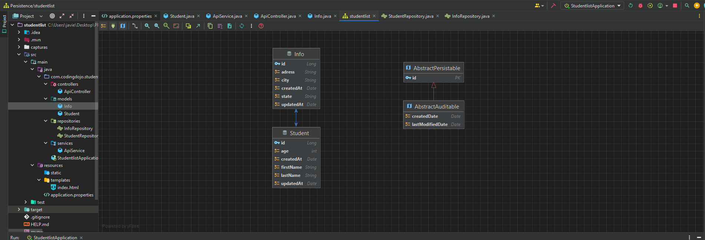
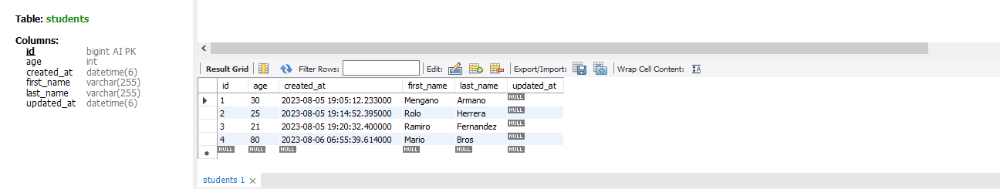
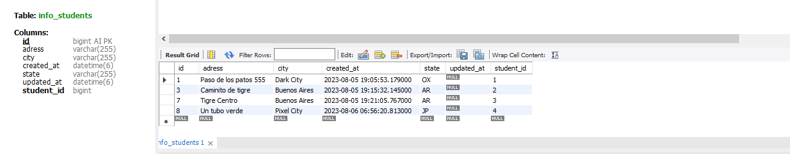
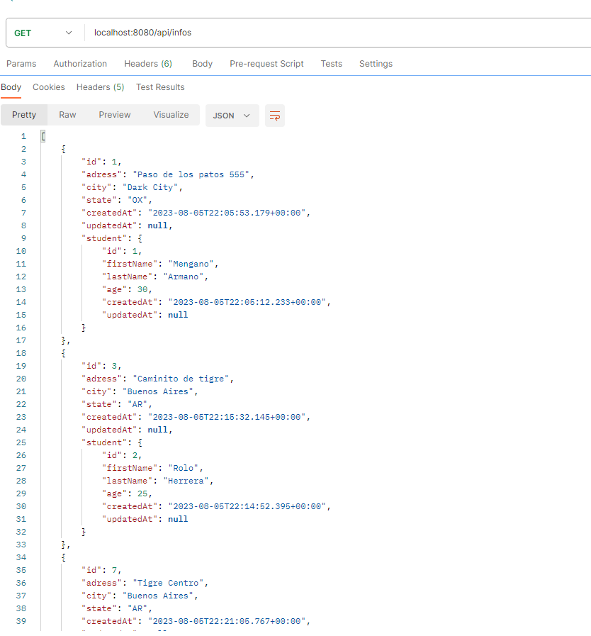
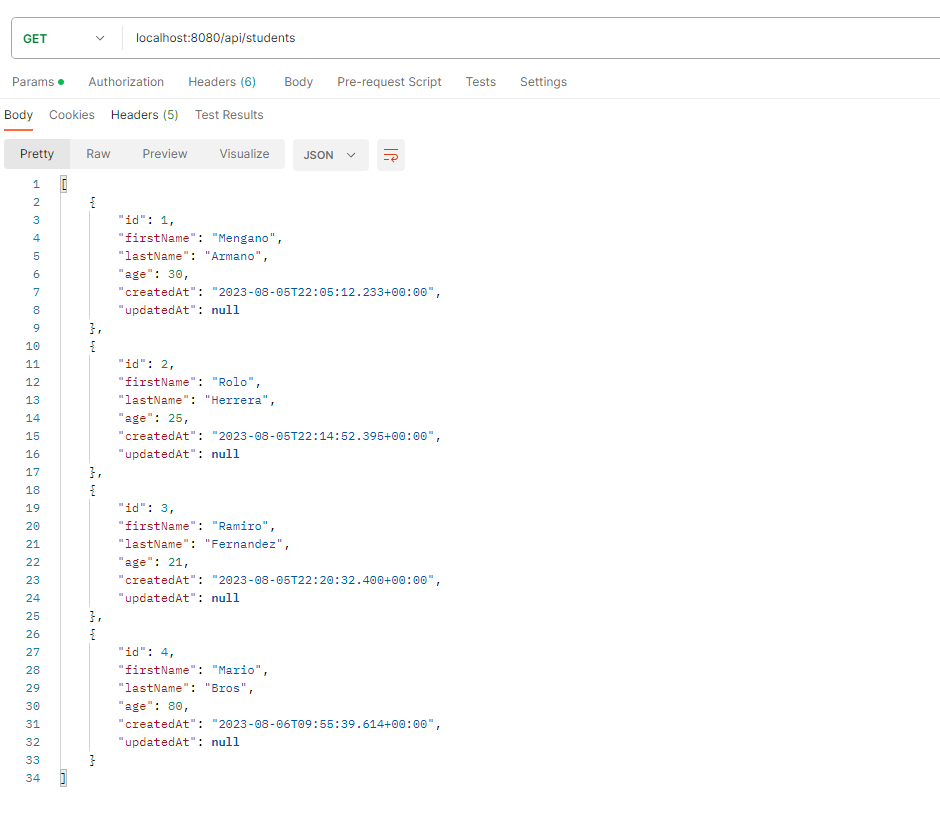

# API Estudiantes y direcciones - Coding Dojo Spring Data II

### Este proyecto consta de dos tablas con una relación uno a uno permitiendo cargar estudiantes para luego vincularles la dirección por solicitudes POST

### Características

- Relación entre dos tablas en la base de datos SQL.
- Realizado con RestController, no es MVC.

  
  
  
  

